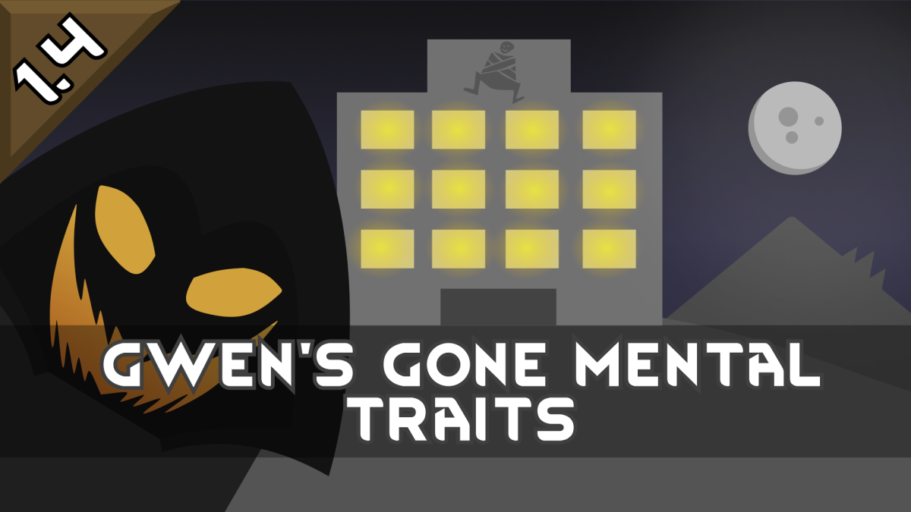

<!--[![GPLv3][badge-license]](https://www.gnu.org/licenses/gpl-3.0) -->
[badge-license]: https://img.shields.io/badge/License-GPLv3-lightgray
<!--![Supports Royalty][badge-dlc-royalty] supports Royalty DLC-->
[badge-dlc-royalty]: https://img.shields.io/badge/DLC-Royalty-gold
<!--![Supports Ideology][badge-dlc-ideology] supports Ideology DLC-->
[badge-dlc-ideology]: https://img.shields.io/badge/DLC-Ideology-indianred
<!--![Supports Biotech][badge-dlc-biotech] supports Biotech DLC-->
[badge-dlc-biotech]: https://img.shields.io/badge/DLC-Biotech-mediumturquoise
<!--![Supports Anomaly][badge-dlc-anomaly] supports Anomaly DLC-->
[badge-dlc-anomaly]: https://img.shields.io/badge/DLC-Anomaly-darkseagreen
<!--![Supports Odyssey][badge-dlc-odyssey] supports Odyssey DLC-->
[badge-dlc-odyssey]: https://img.shields.io/badge/DLC-Odyssey-mediumpurple

# [RCP] Backstories and Traits
\
[![GPLv3][badge-license]](https://www.gnu.org/licenses/gpl-3.0) ![Supports Odyssey][badge-dlc-odyssey]

Use [XML Extensions](https://steamcommunity.com/sharedfiles/filedetails/?id=2574315206) to disable all backstories and traits.

## Backstories
| defName | title | titleShort | description | slot | workDisables | requiredWorkTags | skillgains | spawnCategories | forcedTraits |
|---|---|---|---|---|---|---|---|---|---|
| RCP_Gravship1 | gravship colonist | colonist | [PAWN_nameDef] was born and raised on a gravship. [PAWN_pronoun] received training to repair and maintain the ship's systems.  [PAWN_nameDef] didn't interact with anyone besides [PAWN_possessive] parents and the captain. | Childhood |  |  | Construction: 3 Crafting: 2 Social -2 | Offworld Outlander Pirate ImperialCommon ImperialFighter |  |
| RCP_Gravship2 | asteroid miner | miner | [Pawn_nameDef]'s family owned an orbital mining fleet. When they weren't bartering with traders on the surface, they were moving between mineral-rich asteroids in orbit.  [PAWN_nameDef] spent most of [PAWN_possessive] time hauling valuables to the gravship. | Childhood |  | ManualDumb | Mining: 5 | Offworld Outlander ImperialCommon ImperialFighter |  |
| RCP_Gravship3 | orbital pirate | pirate | [PAWN_nameDef] was raised by an orbital pirate gang. [PAWN_pronoun] was used as bait, pretending to be injured long enough for [PAWN_possessive] crew to ambush anyone who responded to the distress calls.  [PAWN_nameDef] took joy in watching them die. | Childhood |  | Violent | Melee: 3 Shooting: 2 | Offworld Outlander Pirate | Psychopath |
| RCP_Gravship4 | medical student | student | [PAWN_nameDef] grew up on a satellite that offered medical services and ship repairs. [PAWN_pronoun] learned how to perform first aid and helped the surgeon with minor operations. | Childhood |  |  | Intellectual: 2 Medical: 3 | Offworld Outlander ImperialCommon ImperialFighter |  |
| RCP_Gravship5 | hydroponics farmer | farmer | [PAWN_nameDef] was born and raised on a civilian garden vessel. [PAWN_possessive] formative years were spent tending to crops and learning to maintain the hydroponics system.  The ship's crew was small and lacked combat experience, so [PAWN_nameDef] had to help defend against raids. | Childhood |  |  | Crafting: 1 Plants: 3 Shooting: 1 | Offworld Outlander Pirate ImperialCommon ImperialFighter |  |
| RCP_Gravship6 | lone survivor | survivor | [PAWN_nameDef] was the only survivor of a nasty plague. [PAWN_pronoun] drifted alone aboard a derelict gravship for months, living off of the dead crew's rations.  [PAWN_nameDef]'s sculptures kept the loneliness at bay until an orbital trading ship found [PAWN_objective]. | Childhood |  |  | Art: 3 Crafting: 2 | Offworld Outlander Pirate ImperialCommon ImperialFighter |  |
| RCP_Gravship7 | galley porter | porter | [PAWN_nameDef] always dreamed of being a chef. As soon as [PAWN_pronoun] was old enough to work, [PAWN_pronoun] took a job cleaning dishes and prepping vegetables in the galley.  [PAWN_nameDef] spent [PAWN_possessive] free time bantering with the other staff. | Childhood |  |  | Cooking: 3 Social:2 | Offworld Outlander Pirate ImperialCommon ImperialFighter |  |

## Traits
Traits commonalities are low because they are intended to be rare and unobtrusive. Pawns will not spawn with more than one trait from this list.

| defName | label | description | statFactors | statOffsets | forcedPassions | disabledWorkTags | possessions | commonality | prerequisites |
|---|---|---|---|---|---|---|---|---|---|
| RCP_AcePilot | ace pilot | [PAWN_nameDef]'s heart yearns for the stars. |  | PilotingAbility: +50% | Intellectual |  | PilotAssistant | 0.4 | ![RimWorld Odyssey][badge-dlc-odyssey] |
| RCP_Fisherman | angler | [PAWN_nameDef] loves casting lines. [PAWN_pronoun] catches fish faster than everyone else. |  | FishingSpeed: +25% FishingYield: +10% | Animals |  | Fish_Catfish: 5~10 | 0.4 | ![RimWorld Odyssey][badge-dlc-odyssey] |
| RCP_DrugDealer | drug dealer | [PAWN_nameDef] has a knack for cutting deals on illicit substances and can synthesize drugs with remarkable efficiency. |  | DrugCookingSpeed: +25% DrugSynthesisSpeed: +25% DrugSellPriceImprovement: +10% |  |  | Flake: 5~10 | 0.4 |  |
| RCP_Eloquent | eloquent | [PAWN_nameDef] has the gift of gab. Negotiations come naturally to [PAWN_objective]. |  | SocialImpact: +200% NegotiationAbility: +50% TradePriceImprovement: +50% ConversionPower: +50% | Social |  | Apparel_BowlerHat | 0.4 |  |
| RCP_GreenThumb | green thumb | [PAWN_nameDef] is a plant whisperer. Working with crops comes naturally to [PAWN_objective]. |  | PlantWorkSpeed: +25% PlantHarvestYield: +10% | Plants |  | PlantPot | 0.4 |  |
| RCP_Laborer | laborer | [PAWN_nameDef] lacks the finesse for skilled tasks, but excels at hard, physical labor. | GeneralLaborSpeed: 50% | CleaningSpeed: +25% CarryingCapacity: +15 |  | ManualSkilled |  | 0.1 |  |

## Legal
Portions of the materials used to create this mod are trademarks and/or copyrighted works of Ludeon Studios Inc. All rights reserved by Ludeon. This mod is not official and is not endorsed by Ludeon.